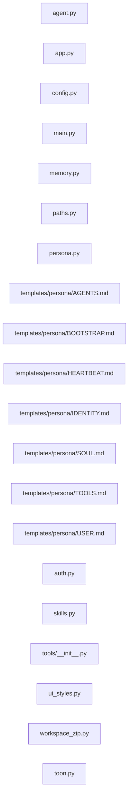

Issue Implementation Check

| Field      | Value |
|------------|-------|
| Verdict    | Issue context unavailable |
| Confidence | 71% |

🔴 Blocker Issues

None.

🟠 Critical Issues

1. [BUG] agent.py (`agent.py`) · CRIT-01

Reason:
In `answer_directly`, the bare `except Exception:` block silently swallows all error detail and then issues a redundant second call to `create_chat_completion` with `FALLBACK_MODEL`. Because `create_chat_completion` already implements primary→fallback switching internally and raises a clear `RuntimeError` when neither client is available, the outer try/except hides that signal entirely. Worse, the second call passes `FALLBACK_MODEL` directly into a function that will again attempt the full primary→fallback chain, meaning a configuration error produces two failed attempts with the root cause lost and no error surfaced to the caller or UI.

Fix:
Remove the inner try/except from `answer_directly` entirely. `create_chat_completion` already handles primary/fallback switching and raises clearly when neither client is available. Let exceptions propagate naturally.

🟡 Major Issues

1. [BUG] persona.py (`persona.py`) · MAJOR-01

Reason:
In `build_system_prompt`, `ensure_persona_files(user_id)` is called without `display_name`. If `USER.md` does not yet exist at call time (first run or race between callers), it will be created with `{display_name}` substituted by the raw `user_id` string rather than the human-readable display name. Callers in `agent.py` correctly resolve `display` via `_user_display_name` before calling `build_system_prompt`, but the internal call inside `build_system_prompt` discards that resolved value.

Fix:
Add a `display_name: str | None = None` parameter to `build_system_prompt` and thread it through to the internal `ensure_persona_files(user_id, display_name)` call. Update callers in `agent.py` to pass `display`.

2. [BUG] persona.py (`persona.py`) · MAJOR-02

Reason:
In `build_project_context`, the return value of `_add_section` is ignored inside the `CORE_FILES` loop. `_add_section` returns `False` when the total character budget (`BOOTSTRAP_TOTAL_MAX_CHARS`) is exhausted. This means core files can be silently dropped from the injected system prompt with no marker, truncation note, or break — the loop continues iterating, wasting cycles and potentially producing an inconsistent partial context. The `OPTIONAL_FILES` loop correctly checks `if not _add_section(...): break`, but the core loop does not.

Fix:
Capture the return value in the `CORE_FILES` loop: `if not _add_section(filename, content): break` (or at minimum log a warning), consistent with the optional-file loop pattern.

3. [CODE SMELL] paths.py (`paths.py`) · MAJOR-03

Reason:
`user_agent_home` is a direct alias for `user_workspace_root`, placing persona/bootstrap files (AGENTS.md, SOUL.md, MEMORY.md, etc.) in the same flat directory as task workspace subdirectories. `is_task_workspace_dir` excludes only `memory`, `avatars`, `skills`, and `canvas` — not the persona `.md` files themselves. As a result, `sync_workspaces_to_memory` will iterate AGENTS.md, SOUL.md, etc. as if they were task workspace entries (they are files, not dirs, so `os.path.isdir` saves them there), but the workspace folder count in the Memory UI (`folder_count`) uses `is_task_workspace_dir` which would count any future subdirectory named e.g. `SOUL` or similar. More critically the flat layout is architecturally fragile: any tool writing a file named `memory` or `avatars` into the task workspace root would collide with persona subdirs.

Fix:
Give `user_agent_home` a dedicated subdirectory such as `workspaces/<user_id>/.agent/` or `workspaces/<user_id>/agent_home/` to cleanly separate persona storage from task workspace storage.

4. [VULNERABILITY] file_ops.py (`tools/file_ops.py`) · MAJOR-04

Reason:
`write_file` and `patch_file` perform no path validation or sandboxing. The agent is instructed to write only inside the task workspace, but the tool itself will write to any absolute path the LLM provides — including persona files, system paths, or other users' workspaces. This pre-existed this commit but the persona system now places sensitive files (SOUL.md, USER.md, IDENTITY.md) in `user_agent_home`, which is the same root as the task workspace, making them directly reachable by a prompt-injected `write_file` call with a path like `../SOUL.md`.

Fix:
Add workspace-boundary enforcement in `write_file` and `patch_file` that rejects paths resolving outside the user's assigned task workspace. Pass the allowed root through the tool invocation context.

⚪ Minor Issues

1. [CODE SMELL] USER.md (`templates/persona/USER.md`) · MINOR-01

Reason:
The template uses `{display_name}` as a plain Python f-string-style placeholder in two places. If any future code path calls `ensure_persona_files` or `reset_persona_file` without the `USER.md` special-case branch (e.g. a new helper that iterates all templates generically), the raw placeholder will be written to disk and injected verbatim into the LLM system prompt.

Fix:
Use a more distinctive sentinel that is unlikely to appear in user content, such as `{{USER_DISPLAY_NAME}}`, and add an assertion or test verifying the placeholder is never present in the rendered output.

2. [CODE SMELL] persona.py (`persona.py`) · MINOR-02

Reason:
`read_persona_file` and `write_persona_file` apply both an `EDITABLE_FILES` membership check and a `_FILE_RE` regex check. All members of `EDITABLE_FILES` already satisfy `_FILE_RE` by construction, making the regex redundant. This creates a maintenance trap: a file added to `EDITABLE_FILES` that does not match the regex would raise unexpectedly at runtime rather than at definition time.

Fix:
Remove the `_FILE_RE.match` guard from both functions and rely solely on the `EDITABLE_FILES` allowlist, which is the authoritative source of truth. If the regex is meant as a defence-in-depth sanitiser, add a comment explaining why.

Summary

| Severity | Count |
|----------|------:|
| Blocker  | 0 |
| Critical | 1 |
| Major    | 4 |
| Minor    | 2 |
| Total    | 7 |

===== AST DEPENDENCY GRAPH =====
